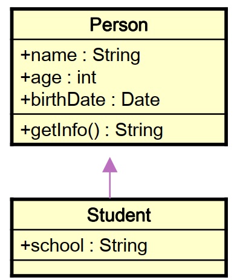
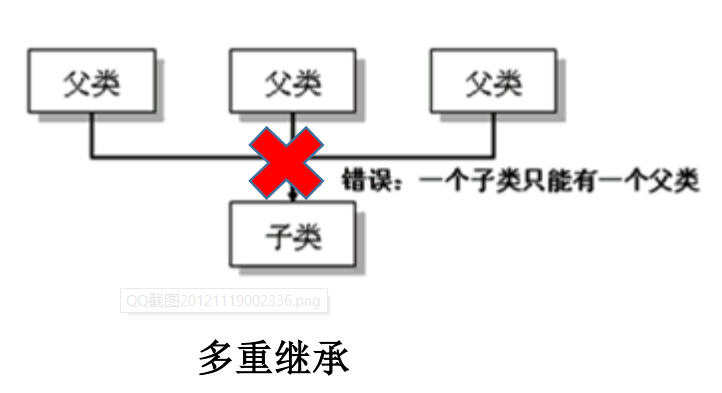
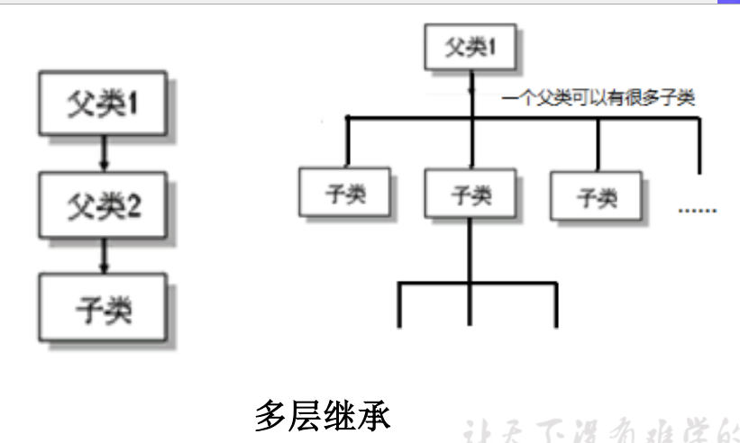

# [java]继承性(inheritance)


### 为什么要有继承？

- 多个类中存在相同属性和行为时，将这些内容抽取到单独一个类中，那么多个类无需再定义这些属性和行为，只要继承那个类即可。

##### 继承性的好处

- 减少了代码的冗余，提高了代码的复用性
- 便于功能的扩展
- 为之后多态性的使用，提供了前提

注意：不要仅为了获取其他类中某一个功能而去继承

### 子类/父类

- 此处的多个类称为子类(派生类)
- 单独的这个类称为父类(基类或超类)
- 可以理解为:“子类 is a 父类”  

### Object

- 若没有显式地声明一个类的父类的话，则此类继承与java.lang.Object类
- 所有的java类(除java.lang.Objec类之外)都直接或间接的继承于java.lang.Object类
- 所有的java类都具有java.lang.Object类声明的功能

### 类继承语法

`class Subclass extends SuperClass{ }  `


### 继承性(inheritance)  

- 子类继承了父类，就继承了父类的方法和属性。
- 在子类中，可以使用父类中定义的方法和属性，也可以创建新的数据和方法。
- 在Java中，继承的关键字用的是“extends”, 即子类不是父类的子集，而是对父类的“扩展”。
- 特别地，父类中声明为private的属性或方法，子类继承父类以后，仍然认为获取了父类中私有的结构。只因为封装性的影响，使得子类不能直接调用父类的结构而已。

### 关于继承的规则：

子类不能直接访问父类中私有的(private)的成员变量和方法。


### 例



```java
class Person {
	public String name;
	public int age;
    public Date birthDate;
    
	public String getInfo() {
		// ...
	}
}

class Student extends Person {
	public String school;
}

// Student类继承了父类Person的所有属性和方法，并增加了一个属性school。 Person中的属性和方法,Student都可以使用。
```


### Java只支持单继承和多层继承， 不允许多重继承  

-   一个子类只能有一个父类 （单继承性）（接口可以多继承）
- 一个父类可以派生出多个子类

```java
class SubDemo extends Demo{} //ok
class SubDemo extends Demo1,Demo2... // error
```




